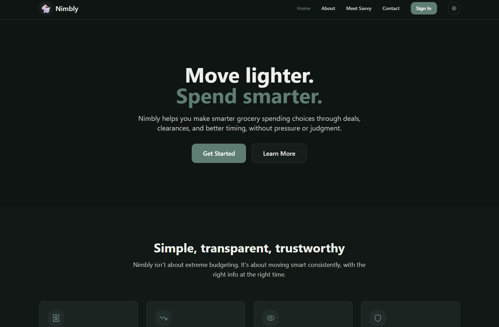
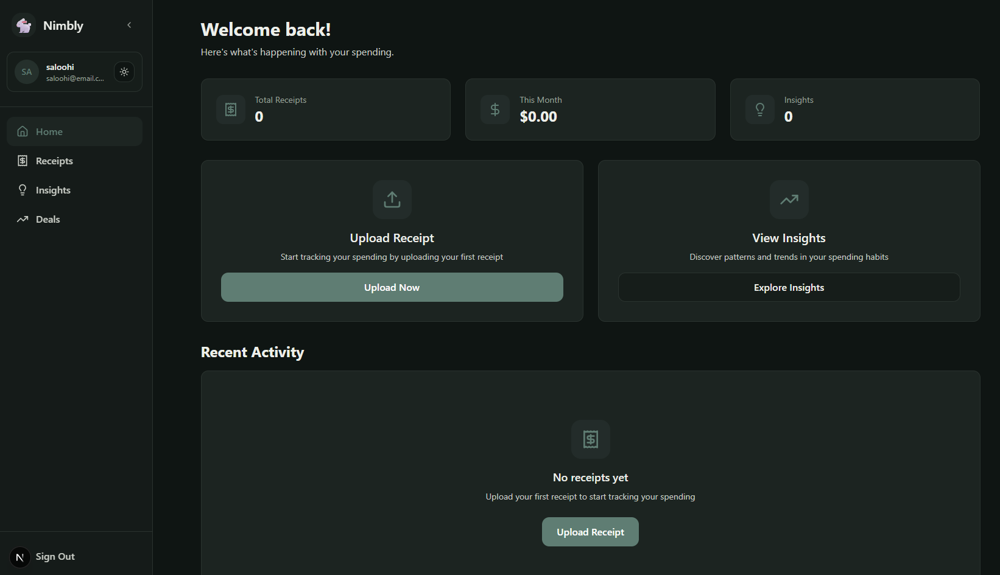
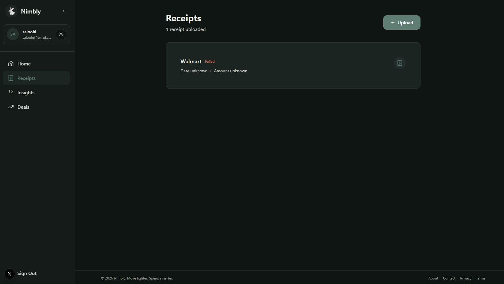
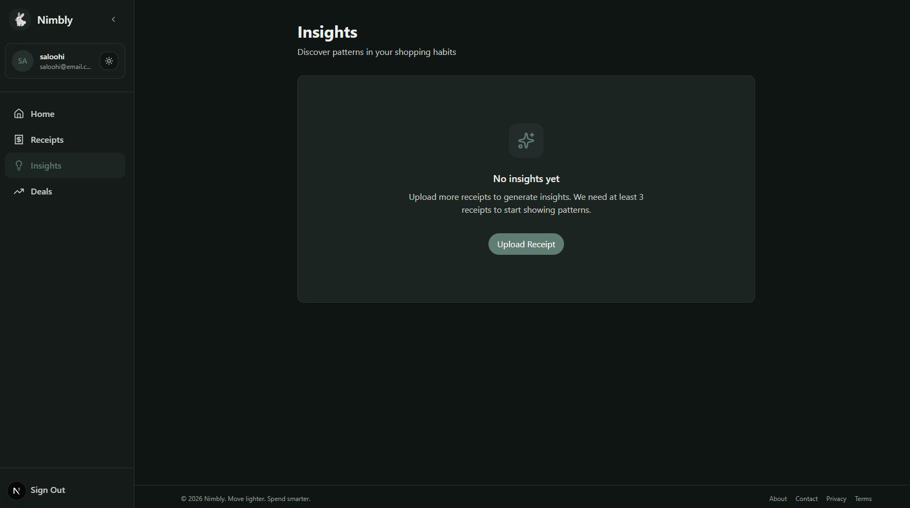
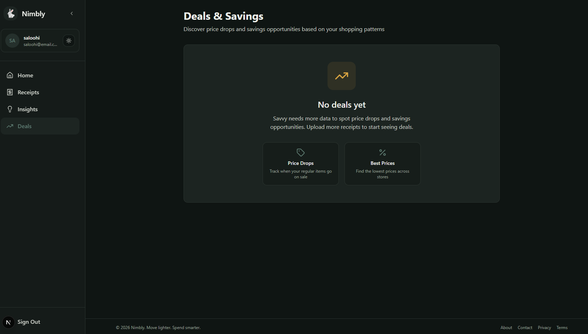
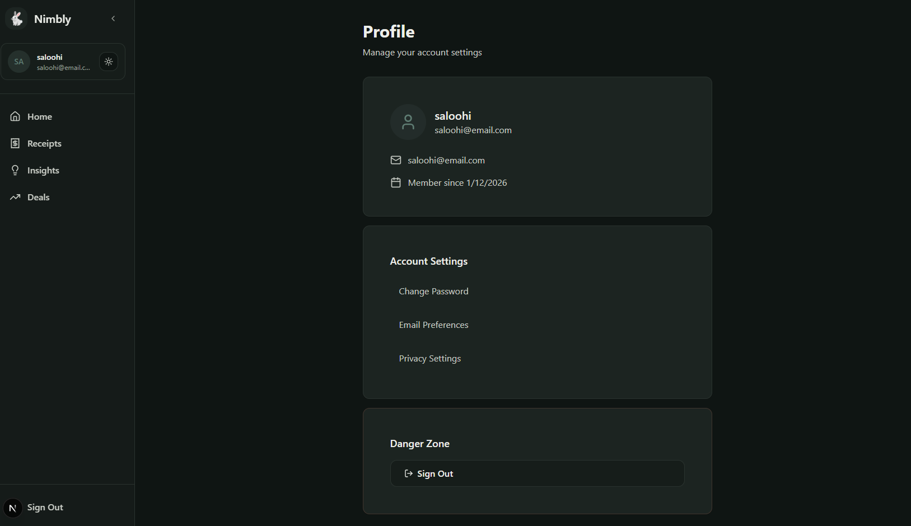
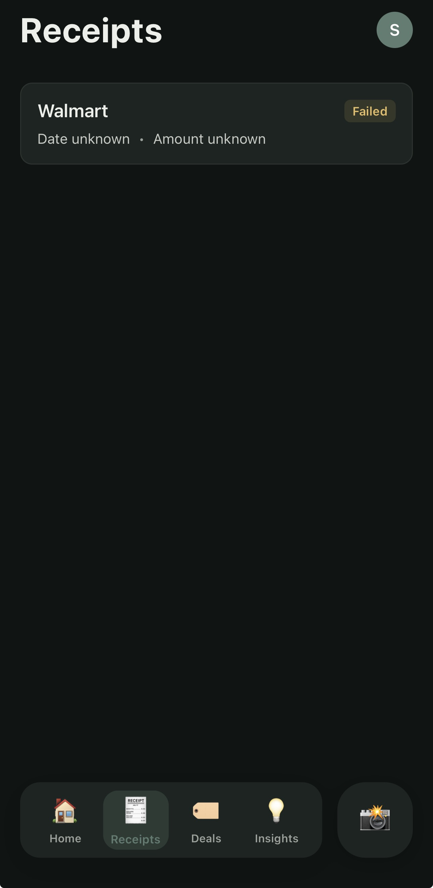
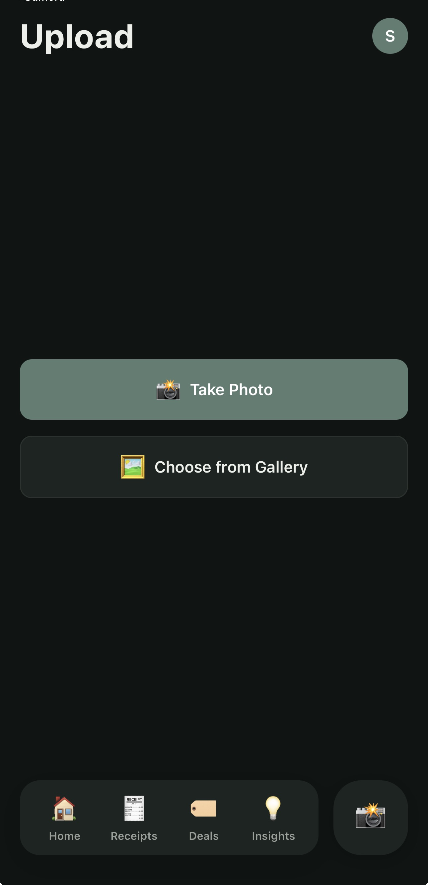
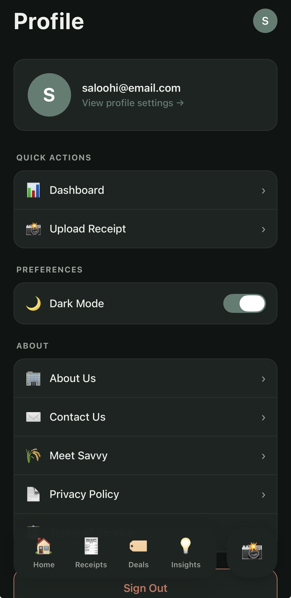

# 🐇 Nimbly

Move lighter. Spend smarter.

**Nimbly** is a people-first app for **smarter everyday spending**, starting with groceries.  
It highlights deals, surfaces clearances, and nudges you toward better timing without guilt, pressure, or finance jargon.

Nimbly isn't about extreme budgeting.  
It's about **moving smart, consistently**.

---

## 📑 Table of Contents

- [🤖 Meet Savvy](#-meet-savvy)
- [✨ What Nimbly does](#-what-nimbly-does)
- [🌱 Why Nimbly exists](#-why-nimbly-exists)
- [🎯 Goals](#-goals)
- [🚀 Quick Start](#-quick-start)
- [📁 Project Structure](#-project-structure)
- [📸 Screenshots](#-screenshots)
- [🚧 Project Status](#-project-status)
- [🛠️ Tech stack](#️-tech-stack)
- [🧠 Philosophy](#-philosophy)
- [📬 Contributing](#-contributing)

---

## 🤖 Meet Savvy

**Savvy** is your in-app guide.

Savvy keeps an eye on prices, notices patterns, and gives you a heads-up when there's a better move to make.

No lectures.  
No judgment.  
Just the right info at the right time.

---

## ✨ What Nimbly does

- Surfaces grocery deals and clearances  
- Helps you spot better buying opportunities  
- Encourages smarter timing on everyday purchases  
- Keeps the experience fast, light, and human  

---

## 🌱 Why Nimbly exists

Groceries are getting expensive.  
Everyday spending decisions are getting harder.  
Most tools either shame you or overwhelm you.

Nimbly exists to help everyday people:
- spend smarter on essentials  
- make better decisions without stress  
- build healthier money habits over time  

Small wins. Real relief.

---

## 🎯 Goals

- Help people spend less on everyday groceries  
- Reduce decision fatigue around shopping  
- Build clarity instead of guilt  
- Turn small savings into long-term stability over time  

Small, repeatable wins. Long game.

---

## 🚀 Quick Start

### Automated Setup (Recommended)

**Unix/Mac:**
```bash
chmod +x scripts/setup.sh
./scripts/setup.sh
```

**Windows:**
```cmd
scripts\setup.bat
```

This will automatically:
- Check dependencies (Docker, Node.js)
- Set up environment files
- Build and start containers
- Seed the database
- Install web dependencies

### Manual Setup

If you prefer manual setup:

```bash
# 1. Start backend
docker-compose up -d

# 2. Seed database
docker-compose exec api python -m api.seed

# 3. Install web dependencies
cd web && npm install

# 4. Start web app
npm run dev
```

### Access

- **API:** http://localhost:8000
- **API Docs:** http://localhost:8000/docs
- **Web App:** http://localhost:3000 (after running `npm run dev`)

See `api/README.md` for detailed backend setup and `docs/testing.md` for testing guide.

---

## 📁 Project Structure

```
nimbly/
├── api/                    # FastAPI backend
│   ├── tests/              # Backend test suite
│   ├── auth.py             # Authentication endpoints
│   ├── receipts.py         # Receipt endpoints
│   ├── insights.py         # Insight generation
│   ├── parser.py           # Receipt parsing (OCR, extraction)
│   ├── models.py           # Database models
│   ├── schemas.py          # Pydantic schemas
│   ├── database.py         # Database configuration
│   ├── config.py           # App configuration
│   ├── utils.py            # Utility functions
│   └── seed.py             # Database seeding
│
├── web/                    # Next.js web app (Phase 1 ✅)
│   ├── app/                # Pages and routes
│   │   ├── auth/           # Authentication (sign up, sign in)
│   │   ├── dashboard/      # Dashboard home
│   │   ├── receipts/       # Receipt list, detail, upload
│   │   ├── insights/       # Insights feed
│   │   ├── deals/          # Deals page
│   │   ├── profile/        # User profile
│   │   └── not-found.tsx   # 404 page
│   ├── components/         # React components
│   │   ├── ui/             # Base UI components (shadcn/ui)
│   │   ├── navigation/     # Sidebar, bottom nav
│   │   ├── app-layout.tsx  # Main layout
│   │   ├── theme-provider.tsx
│   │   └── ...
│   └── lib/                # Utilities
│       ├── api.ts          # API client
│       └── utils.ts        # Helper functions
│
├── mobile/                 # React Native mobile app (Phase 1 🚧)
│   ├── app/                # Expo Router pages
│   ├── components/         # Mobile components
│   └── lib/                # Utilities
│
├── docs/                   # Documentation
│   ├── requirements.md     # Feature requirements
│   ├── design.md           # System design
│   ├── tasks.md            # Implementation tasks
│   ├── phases.md           # Development phases
│   ├── visuals.md          # Visual design system
│   ├── tone.md             # Voice and tone guide
│   ├── testing.md          # Testing guide
│   └── CHANGELOG.md        # Version history
│
├── scripts/                # Helper scripts
│   ├── setup.sh/.bat       # Automated setup
│   ├── dev.sh/.bat         # Start dev environment
│   ├── test.sh/.bat        # Run tests
│   └── README.md           # Scripts documentation
│
├── uploads/                # Receipt file storage
├── docker-compose.yml      # Docker configuration
├── Dockerfile              # API container definition
├── .env.example            # Environment variables template
├── CONTRIBUTING.md         # Contribution guidelines
└── README.md               # This file
```

---

## 📸 Screenshots

<details>
<summary><strong>🌐 Web App</strong></summary>

### Landing Page


### Dashboard


### Receipts


### Insights


### Deals


### Profile


</details>

<details>
<summary><strong>📱 Mobile App</strong></summary>

### Dashboard


### Receipts


### Insights


### Deals


### Upload


### Profile


</details>

---

## 🚧 Project Status

**Phase 0 (Backend Foundation):** ✅ Complete
- Magic link authentication
- Receipt upload and parsing (OCR)
- Price history tracking
- Insight generation (4 types)
- Comprehensive error handling
- Structured logging
- Docker deployment
- Test suite

**Phase 1 (Web App):** ✅ Complete
- Email/password + social authentication
- Receipt upload (drag-and-drop + file picker)
- Receipt list and detail views
- Insights feed with 4 insight types
- Professional UI with Sage/Amber colors
- Light/dark mode with theme toggle
- Collapsible sidebar with state persistence
- Responsive design (desktop + mobile web)
- Loading, empty, and error states

**Phase 1 (Mobile App):** 🚧 Next Priority
- React Native with Expo
- Camera integration for receipts
- Same features as web app
- Timeline: 2-3 weeks

**Phase 2 (Infrastructure & Understanding):** 📋 Planned
- Async processing (Celery + Redis)
- Scalable storage (MinIO/S3)
- LLM integration (Gemini 2 Flash)
- Advanced insights (5 new types)
- Performance optimization

See `docs/roadmap.md` for complete development plan.

---

## 🛠️ Tech stack

- **API:** FastAPI  
- **Database:** PostgreSQL  
- **Web app:** Next.js (shadcn/ui + Framer Motion)  
- **Mobile app:** React Native  
- **Infra:** Docker  

---

## 🧠 Philosophy

> Move fast. Stay aware. Don't get played.

That's Nimbly.

---

## 📬 Contributing

We welcome contributions! See [CONTRIBUTING.md](CONTRIBUTING.md) for guidelines.

---

Built with 💖 for everyday people trying to get by.
